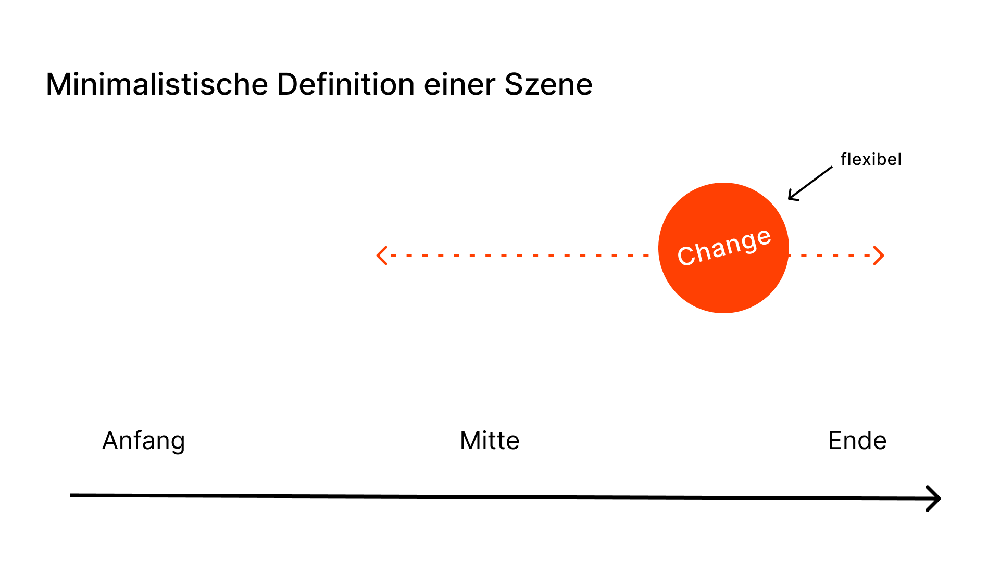

# Variable Stories

CSS Animation, Variable Fonts und Storytelling.

## Aufgabenstellung

Mit CSS animierst du Variable Fonts. Inhaltlich orientierst du dich an Storytelling Prinzipien.

## Tag 1: Variable Fonts kennenlernen

### Recherche

Auf [v-fonts.com](https://v-fonts.com), Foundry Websites oder auf anderen Plattformen suchst du Variable Fonts.

- Wähle eine oder mehrere Schriften, deren *Achsen* dir interessant scheinen.
- Finde heraus, ob es eine Trial-Version des Fonts gibt, oder ob er sich per Link einbinden lässt.

### Storyboard

- Überlege dir, wie du mit wenigen Zeichen eine ganz einfachen Plot mit einer einzigen Szene herstellen könntest.
- Die Szene besteht aus Anfang, Mitte, Ende und Change (siehe Abbildung).
- Der Plot folgt einem der 7 typischen Muster (siehe unten).
- Stelle ein einfaches Storyboard her (max 3 Bilder).
- Teile dein Storyboard inkl. 2 Bilder, die die Achsen des Fonts illustrieren, in Discord.

### Sieben grundlegende Erzählungen 

1. Overcoming the Monster / Sieg über das Monster
2. Rags to Riches / Vom Tellerwäscher zum Millionär
3. The Quest / Die Suche
4. Voyage and Return / Reise und Rückkehr
5. Comedy / Komödie
6. Tragedy / Tragödie
7. Rebirth / Wiedergeburt

### Eine einfache Animation coden

- Füge deinen Font dem abgegebenen Projektordner hinzu.
- Binde den Font ein.
- Teste, ob du mit der CSS-Eigenschaft `variable-font-settings` das Aussehen eines Text-Elements ändern kannst.
- Setze deine Animation um.

## Tag 2 – tbd

## Tag 3 – tbd

## Abgabe – tbd
