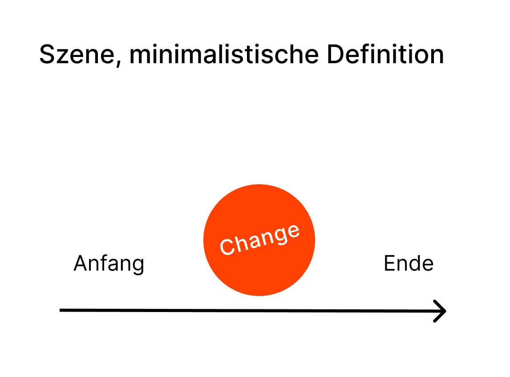

# Variable Stories

CSS Animation, Variable Fonts und Storytelling.

## Aufgabenstellung

Ausgehend von den Eigenschaften deiner gewählten Variable Fonts entwickelst du CSS-Animationen, die auf einer archetypischen Erzählung beruhen. Du beginnst mit ganz einfachen Abläufen, die du verfeinerst und ausbaust.

Umfang: Bis zum 31. Oktober du erkundest sieben Variable Fonts und stellst mindestens vier ausgearbeitete Animationen her.

## Ziele

- Du setzt dich vertieft mit Variable Fonts auseinander: Welche Eigenschaften hat das Format und welche gestalterischen Möglichkeiten bietet es?
- Du erprobst den Einsatz von Storytelling-Methoden: Hilft es dir, an gestalterische Aufgabenstellungen heranzugehen? Bringt es dich auf Ideen? Hilft es dir bei der Reflexion und beim Reden über das Projekt?
- Du vertiefst deine Coding-Skills und dein Verständnis über Animationen.

## Tag 1: Variable Fonts kennenlernen

### Recherche

Auf Foundry Websites oder auf anderen Plattformen suchst du Variable Fonts (Links findest du unter dem folgenden Abschnitt).

- Wähle eine oder mehrere Schriften, deren *Achsen* dir interessant scheinen.
- Finde heraus, ob es eine Trial-Version des Fonts gibt, oder ob er sich per Link einbinden lässt.
- Lade den Font, füge ihn in die abgegebene Coding-Vorlage ein.

#### Plattformen

- [V-Fonts](https://v-fonts.com/)
- [Future Fonts](https://www.futurefonts.com/fonts?sort=random&page=1&limit=24&features=variable)
- [Flint\*ype](https://flintype.com/)
- [Adobe Fonts](https://fonts.adobe.com/fonts?browse_mode=default&cc=true&min_styles=1&max_styles=26&font_technology=vf)
- [Google Fonts](https://fonts.google.com/?categoryFilters=Technology:%2FTechnology%2FVariable)

#### Foundries

- [DJR, Beispiel Extendomatic](https://typeset.djr.com/?ff=extendomatic)
- [Grilli Type](https://www.grillitype.com/)
- [Dinamo](https://abcdinamo.com/)
- [Newglyph](https://newglyph.com/typefaces/)

### Storyboard

- Überlege dir, wie du mit wenigen Zeichen eine ganz einfachen Plot mit einer einzigen Szene herstellen könntest.
- Die Szene besteht aus Anfang, Mitte, Ende und Change (siehe Abbildung).
- Der Plot folgt einem der 7 typischen Muster (siehe unten).
- Zeichne ein einfaches Storyboard mit 3 Bildern: Anfang, Change, Ende
- Teile dein Storyboard inkl. 2 Bilder, die die Achsen des Fonts illustrieren, in Discord.

### Sieben grundlegende Erzählungen 

1. Overcoming the Monster / Sieg über das Monster
2. Rags to Riches / Vom Tellerwäscher zum Millionär
3. The Quest / Die Suche
4. Voyage and Return / Reise und Rückkehr
5. Comedy / Komödie
6. Tragedy / Tragödie
7. Rebirth / Wiedergeburt

### Eine einfache Animation coden

- Füge deinen Font dem abgegebenen Projektordner hinzu.
- Binde den Font ein.
- Teste, ob du mit der CSS-Eigenschaft `variable-font-settings` das Aussehen eines Text-Elements ändern kannst.
- Setze deine Animation um.

## Hausaufgabe auf den 15. Oktober

- Entwickle deine Animation weiter (drei Varianten):
    - Experimentiere (erstelle Variationen) mit Dauer, Timing (wann geschieht was?) und Easing.
    - Experimentiere ebenfalls mit Dimensionen, Ausprägung der Bewegung.
- Beschreibe in den Kommentaren zu jeder Version, wie die Szene strukturiert ist.
    - Woraus bestehen Anfang/Mitte/Ende?
    - Was ist der Change?
- Lade bis am 15.10. 3 Versionen auf Paul (1 Zip-Datei).

[Abgabe-Link Hausaufgabe](https://paul.zhdk.ch/mod/assign/view.php?id=114061)

## Tag 2 – tbd

## Tag 3 – tbd

## Abgabe – 9. November

[Abgabe-Link Paul]()
